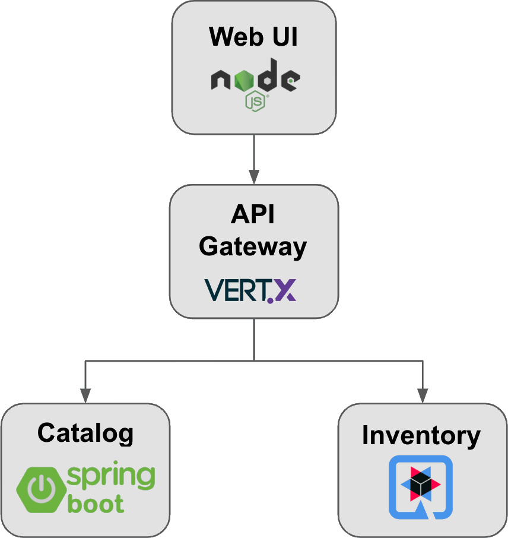

# simple-cloud-store

## Описание
Это простой онлайн магазин состоящий из 3 микросервисов реализованных на Java, но с помощью разных фреймворков, а именно:
- Spring Boot
- Quarkus
- Vert.x

Также есть UI реализованный на Node.js и AngularJS. 

## Архитектура


- сервис каталога (Catalog Service) - использует RESТ АРІ для доступа к содержимому каталога, хранящегося в реляционной базе данных;
- сервис описи запасов (Inventory Service) - использует RESТ АРІ для доступа к описи запасов товаров, хранящейся в реляционной базе данных;
- сервис шлюза (Gateway Service) - принимает запросы и передает их сервису каталогов или сервису описи запасов;
- сервис веб-интерфейса (WebUl Service) - вызывает сервис шлюза, чтобы получить необходимую информацию.

## Запуск
```shell
docker compose up -d
```

## Технологии
- Spring Boot v3.2.4
- Quarkus v3.8.3
- Vert.x v4.4.8
- Java 21
- GraalVM
- Node.js
- AngularJS v1.8.0
- Docker

## Статус
Проект _В разработке_

## Цель
Ознакомиться с новыми фреймворками и развернуть проект в облачной инфраструктуре

## Контакты
Выполнен [Гурьяновым Марком](https://mark1708.github.io/)
#### +7(962)024-50-04 | mark1708.work@gmail.com | [github](http://github.com/Mark1708)


