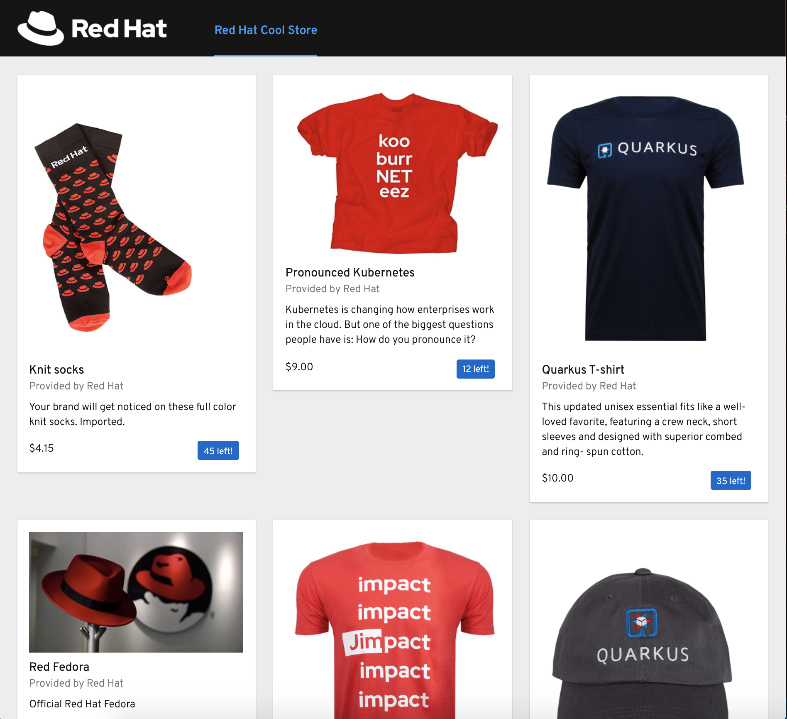

# simple-cloud-store

[Русская версия](README.ru.md)


Full-stack cloud store sandbox with a public React/Vite/TypeScript storefront and three Java microservices behind a Vert.x gateway.

## Summary

| Area | Details |
| --- | --- |
| Purpose | Portfolio demo for comparing Spring Boot, Quarkus, Vert.x, and React service styles in one store flow. |
| Current frontend | `web-react`, React 19.2.1, Vite 7.2.4, TypeScript 5.9.3, PatternFly 6.3.7, Express 5.1.0. |
| Backend services | Catalog API, Inventory API, Gateway API/static edge, PostgreSQL. |
| Compose entrypoint | `docker compose up -d` from the repository root. |
| Public compose ports | PostgreSQL `5432`, Gateway `8080`, Web UI `3000`. |

## Quick start

1. Copy the environment template:

```shell
cp .env.example .env
```

2. Fill in the placeholders in `.env`. Keep secrets local and don't commit real values.
3. Start the local stack:

```shell
docker compose up -d
```

4. Open the app:

```text
http://localhost:3000
```

The gateway is also published at `http://localhost:8080`.

## Screenshots and architecture




## Service matrix

| Service | Path | Stack | Main routes | Ports | Data/config | Documented commands |
| --- | --- | --- | --- | --- | --- | --- |
| Web UI | `web-react` | Node 22 container, React 19.2.1, Vite 7.2.4, TypeScript 5.9.3, Express 5.1.0, PatternFly 6.3.7 | Static storefront served by Express | Compose `3000`; `PORT` defaults to `8080` if unset | Calls the gateway API | `npm ci`; `npm run dev`; `npm run build`; `npm run verify`; `npm run e2e`; `npm run e2e:compose`; `PORT=3000 npm start`; `node --check server.js` |
| Catalog | `catalog-spring-boot` | Spring Boot 3.5.14, Java 21 | `/api/catalog` | Default `8080`; local profile `9000`; internal compose port `8080` | PostgreSQL through environment variables | `./gradlew test`; `./gradlew bootJar -x test --no-daemon`; `./gradlew bootRun --args='--spring.profiles.active=local'` |
| Inventory | `inventory-quarkus` | Quarkus 3.33.1, Java 21 | `/api/inventory/{itemId}` | Internal compose port `8080` | PostgreSQL through environment variables | `./gradlew test`; `./gradlew build -Dquarkus.package.type=native -x test` |
| Gateway | `gateway-vertx` | Vert.x 5.0.12, Java 21 | `/api/products`; `/health`; static `/*` | Compose `8080`; `HTTP_PORT` default `8080` | Calls catalog `/api/catalog` and inventory `/api/inventory/{itemId}` | `./gradlew test`; `./gradlew nativeCompile` |
| Database | Compose service | PostgreSQL | Service data store | Compose `5432` | Configured from `.env` | Started by `docker compose up -d` |

## Request flow

```text
Browser
  -> Web UI on localhost:3000
  -> Gateway on localhost:8080
  -> Catalog service /api/catalog on internal port 8080
  -> Inventory service /api/inventory/{itemId} on internal port 8080
  -> PostgreSQL on compose port 5432
```

Gateway combines catalog and inventory calls for `/api/products`. The web service is the current public frontend and is based on React, Vite, and TypeScript.

## Local development commands

### Root stack

```shell
docker compose up -d
```

### Web UI

```shell
cd web-react
npm ci
npm run dev
npm run build
npm run verify
npm run e2e
npm run e2e:compose
PORT=3000 npm start
node --check server.js
```

### Catalog service

```shell
cd catalog-spring-boot
./gradlew test
./gradlew bootJar -x test --no-daemon
./gradlew bootRun --args='--spring.profiles.active=local'
```

### Inventory service

```shell
cd inventory-quarkus
./gradlew test
./gradlew build -Dquarkus.package.type=native -x test
```

### Gateway service

```shell
cd gateway-vertx
./gradlew test
./gradlew nativeCompile
```

## Useful URLs

| URL | Purpose |
| --- | --- |
| `http://localhost:3000` | Web storefront in the compose stack. |
| `http://localhost:8080` | Gateway public edge. |
| `http://localhost:8080/health` | Gateway health endpoint. |
| `http://localhost:8080/api/products` | Aggregated product API through the gateway. |
| `http://localhost:9000/api/catalog` | Catalog API when the Spring Boot local profile is started directly. |

## Limitations and security

- This is a sandbox and portfolio project, not a production-ready commerce platform.
- The stack doesn't include production authentication, authorization, payments, or user account management.
- `.env.example` is a template only. Keep real `.env` values private.
- Public compose ports are for local development: PostgreSQL `5432`, gateway `8080`, web `3000`.
- Catalog and inventory run behind the gateway in compose and share internal service port `8080`.
- Service boundaries are intentionally separate so the repository can compare framework styles.

## Status

Portfolio/demo project. The code is public as an architecture and implementation reference, not as a production-ready service.

## License

[MIT](LICENSE)
