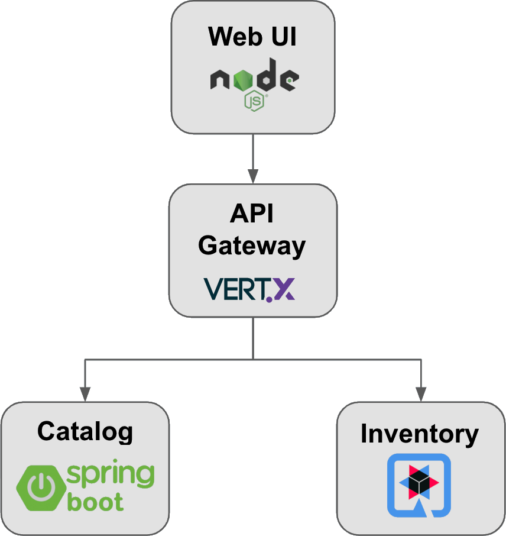

# simple-cloud-store

[English version](README.md)

## Обзор

Демонстрационное полнофункциональное микросервисное приложение, использующее разные Java-фреймворки (Spring Boot, Quarkus, Vert.x) в рамках одного проекта. Песочница для сравнения стилей разных фреймворков и изучения паттернов облачной инфраструктуры.

## Архитектура



## Сервисы

- **Catalog Service** (Spring Boot) -- REST API для каталога товаров, данные в PostgreSQL
- **Inventory Service** (Quarkus) -- REST API для управления запасами, данные в PostgreSQL
- **Gateway Service** (Vert.x) -- API-шлюз, маршрутизирующий запросы к сервисам каталога и запасов
- **Web UI** (Node.js + React/Vite) -- витрина магазина, обращающаяся к шлюзу

## Стек технологий

- Java 21, GraalVM
- Spring Boot 3.5.14
- Quarkus 3.33.1 LTS
- Vert.x 5.0.12
- Node.js 22 LTS
- React 19 + Vite 7 + TypeScript
- Docker

## Быстрый старт

1. Скопируйте шаблон окружения:

```shell
cp .env.example .env
```

2. Заполните значения-заглушки в файле `.env`.
3. Запустите сервисы:

```shell
docker compose up -d
```

4. Откройте веб-интерфейс: `http://localhost:3000`.

## Гигиена

- Не используйте учебные учётные данные вне локальной разработки.
- Храните runtime-настройки сервисов в переменных окружения или local profiles.
- Это демонстрационная настройка без продакшен-аутентификации, платежей и управления пользователями.

## Заметки о проверке

- Тесты Java-сервисов рассчитаны на локальные test settings с H2.
- Для Web UI используется современный verification gate: `npm run verify` плюс `node --check server.js`.
- `npm run security-check` использует `npm audit --audit-level=high`. Текущий npm audit может всё ещё показывать moderate transitive findings, которые не валят high-severity gate.

## Ограничения

- Frontend находится в `web-react` и работает на React/Vite/TypeScript.
- Spring Boot, Quarkus, Vert.x и Node.js сервисы намеренно остаются отдельными, чтобы репозиторий сохранял ценность сравнения разных frameworks.
- Проект не production-ready и не должен использоваться как шаблон для production authentication, payments или user accounts.

## Статус

- Песочница / учебный проект.
